# First Run for Deployment

In the folder specific for `gen_image_ui` deployment, say `gen_image_ui_deployment`

* Create the subfolder `storage`. This subfolder will be used by the `gen_image_ui` deployment as storage for
  - configurations
  - database
  - generated images


* Create the configuration subfolder `storage/config`

* In the configuration subfolder `storage/config`, create configuration file `.env` (i.e. `gen_image_ui_deployment/storage/config/.env`)
    <br>`.env`
    ```
    WAVESPEED_API_KEY="<your wavespeed api key>"
    ```
  Notice you will specify configurations in `.env`, including your secret keys.  

* In `gen_image_ui_deployment`, create the file `docker-compose.yml`, like
    <br>`docker-compose.yml`
    ```
    services:
    gen_image_ui:
        image: trevorwslee/gen-image-ui:0.1.0  # set the desired tag; e.g. 0.1.0, latest, dev
        container_name: gen_image_ui
        ports:
        - "8080:3000"
        volumes:
        - ./storage:/app/backend/storage
        environment:
        - TZ=Asia/Hong_Kong
        restart: unless-stopped
    ```
  This is the Docker compose file for deployment of `gen_image_ui`. Notice:
  - The Docker container name will be `gen_image_ui`.
  - The port mapping is `8080:3000`, which means you can access the `gen_image_ui` at `http://localhost:8080` in your browser. You may have your preferred port for `gen_image_ui`.
  - The volume mapping is `./storage:/app/backend/storage`, which means that the `gen_image_ui` Docker container will usethe subfolder `storage` for configurations and data storage, as hinted previously.
  - The environment variable `TZ` is set to `Asia/Hong_Kong` for setting the timezone. You can set it to your preferred timezone.   


To bring up the `gen_image_ui` Docker container up, in the folder `gen_image_ui_deployment`, run:
```
docker compose up -d
```
If you want to, can watch the logs of the `gen_image_ui` Docker container by running:
```
docker compose logs -f
```

Now that the `gen_image_ui` Docker container is up, you can access the `gen_image_ui` at `http://localhost:8080` in your browser. You should see the `gen_image_ui` home page like:

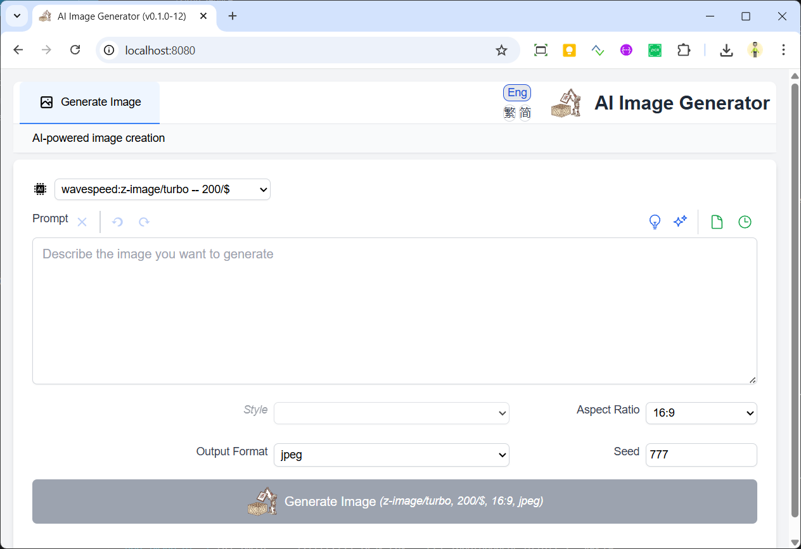


# First Image Generation

It is apparent that you will input the generate image prompt to the `Prompt` text box.

Assume that you don't yet have idea on the image to generate.

1) You can click the `Sample Prompts` button  to see some sample prompts.

  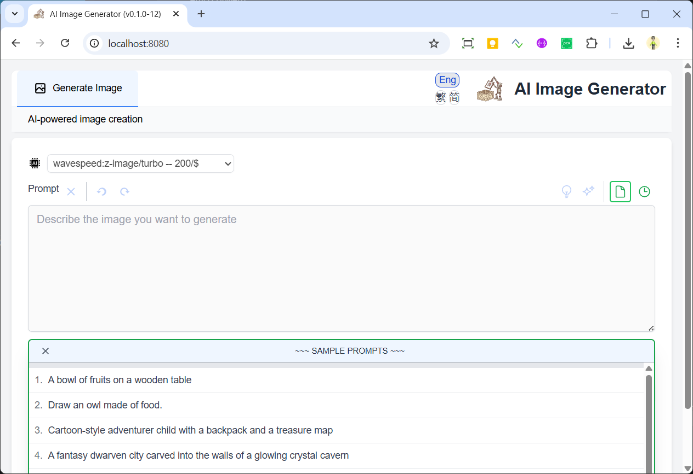

  After selecting the sample prompt, say the 1st one

  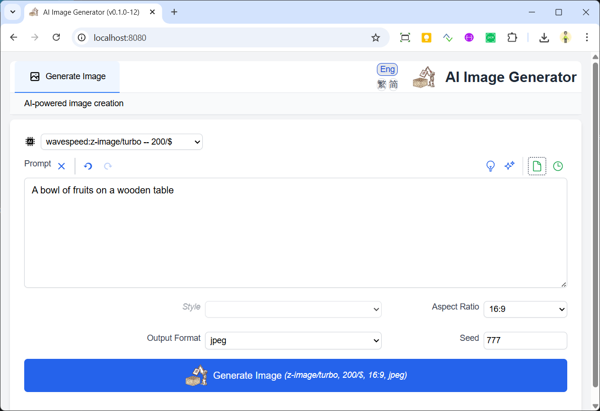

  you click the `Generate Image` button 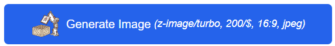 to start the image generation.
  
  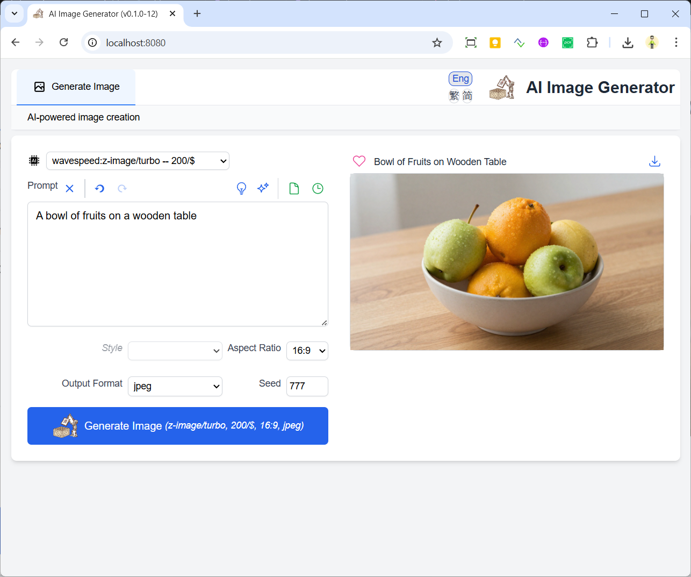

  Notice that you selected to use the model  `wavespeed:z-image/turbo -- 200/$`, which is the LLM model `z-image/turbo` provided by Wave Speed AI, and the recorded cost of image generation using the model is 200 images per 1 USD -- https://wavespeed.ai/models/wavespeed-ai/z-image/turbo
  

  Let's try the second sample

  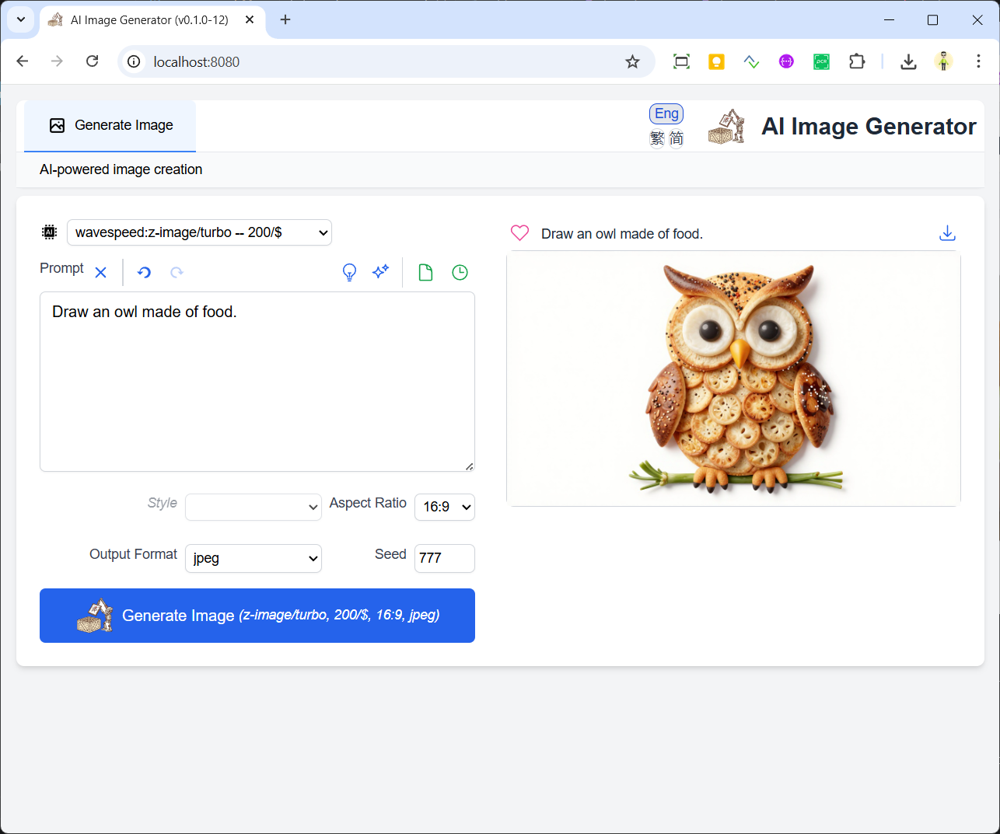

# Image Generation History

If you want to go back to previous image generation, you can click the `Prompt History` button  to see the history of image generations. 

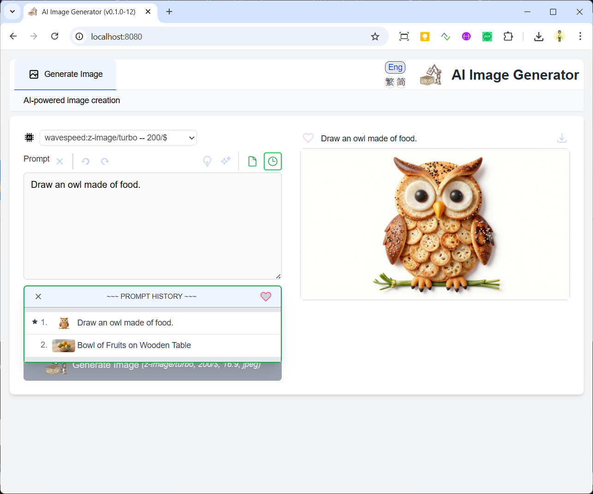


--------------------------


-----------------------------------

https://hub.docker.com/r/trevorwslee/gen-image-ui
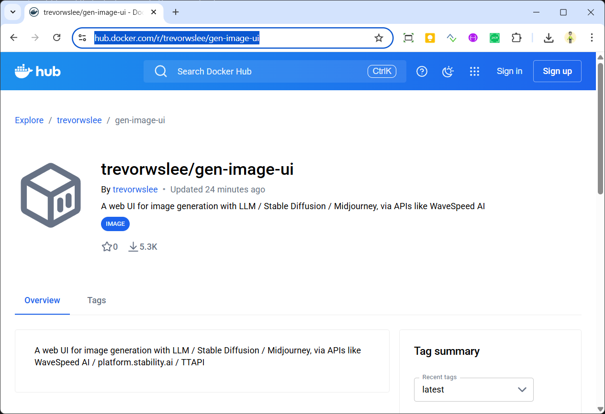


https://wavespeed.ai/
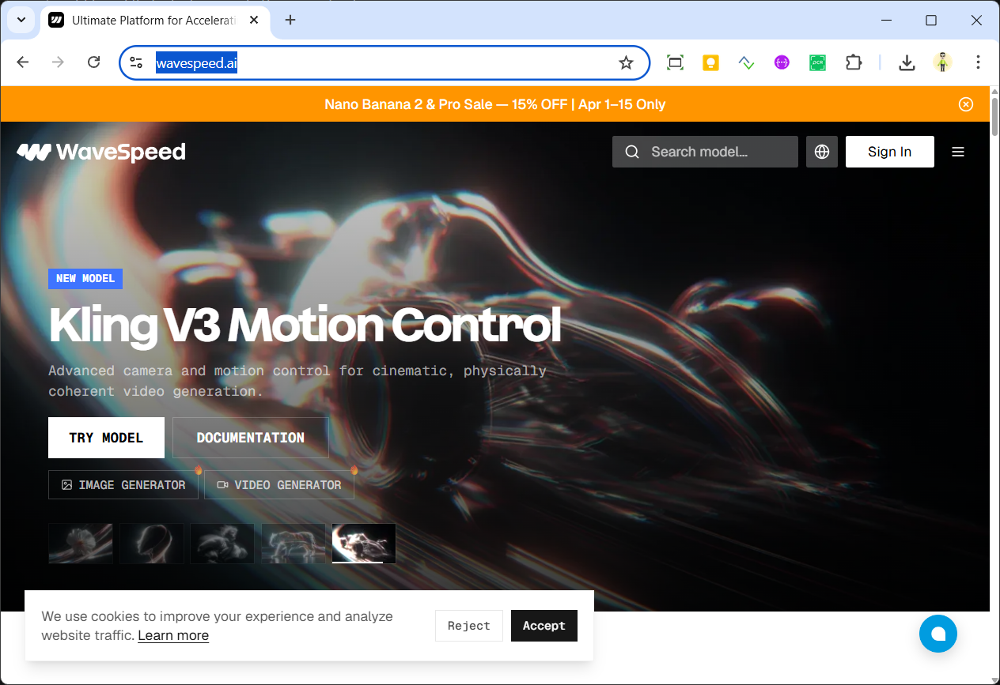

https://platform.stability.ai/

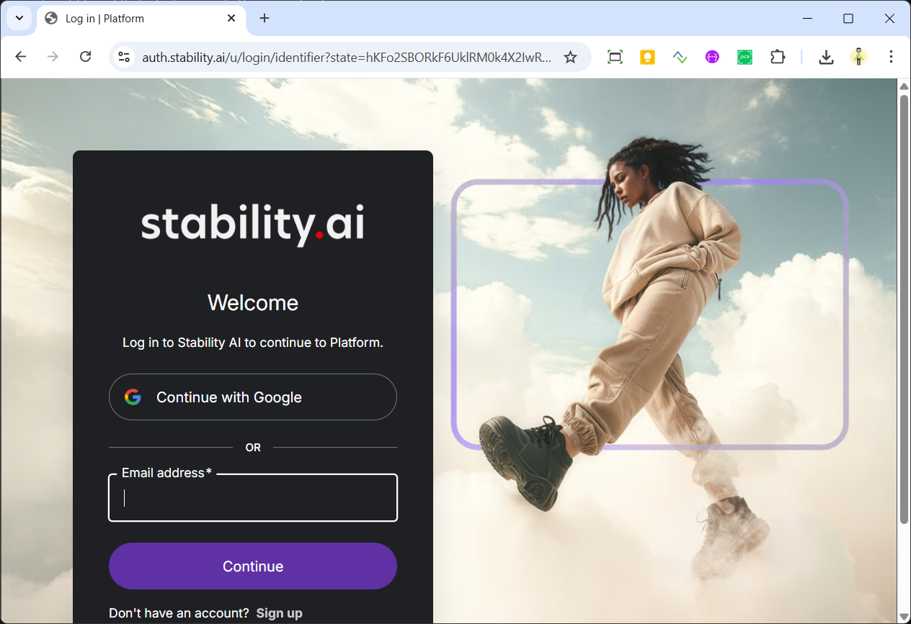


https://ttapi.io/
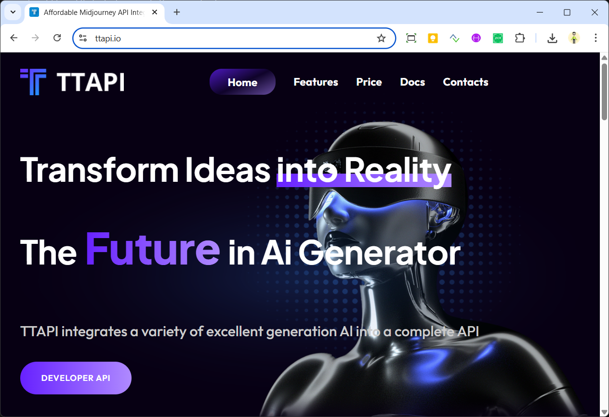

https://openrouter.ai/
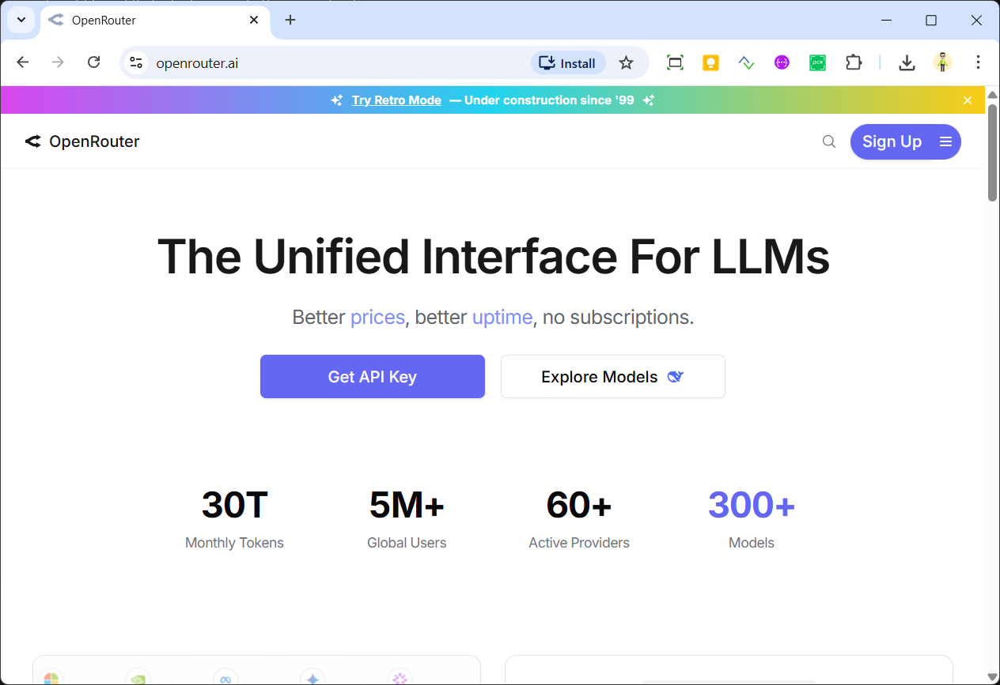